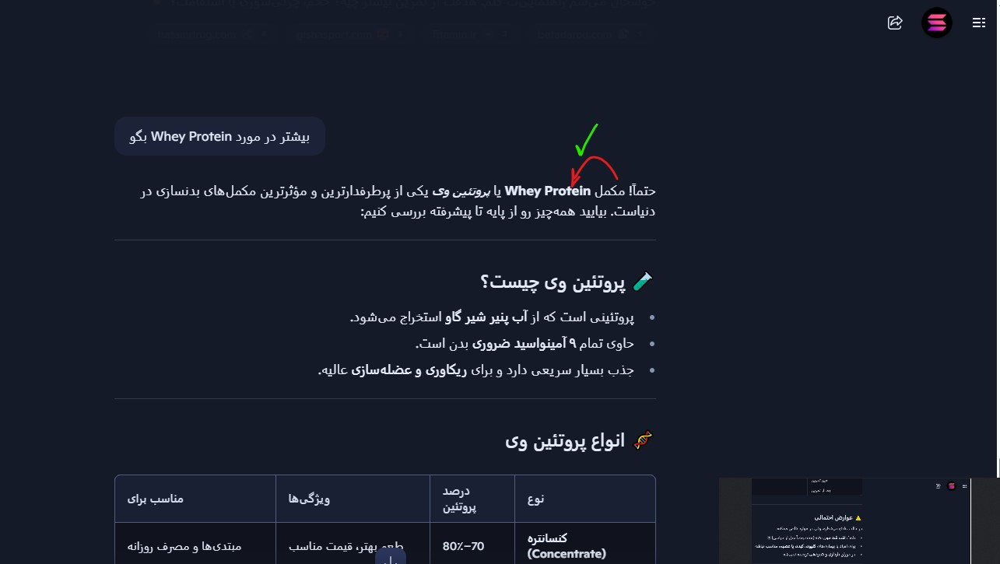

# Copilot RTL Toggle

A simple, effective Chrome extension that adds a Right-to-Left (RTL) / Left-to-Right (LTR) toggle button to the Microsoft Copilot AI chat interface at [https://copilot.microsoft.com/chats/*](https://copilot.microsoft.com/chats/*).

## Why?

Microsoft Copilot's chat UI does not natively support RTL languages (like Arabic, Hebrew, Persian, etc.), making it difficult for users to read and interact with AI responses in their native script. This extension solves that problem by letting you instantly switch the chat direction for both your messages and AI responses.

## Features

- Adds a modern, unobtrusive RTL/LTR toggle button directly to the Copilot chat UI.
- Instantly switches the direction of both user and AI messages.
- Remembers the toggle state as you interact with the page.
- Works seamlessly with dynamic UI changes and screen resizing.
- No tracking, no ads, no unnecessary permissions—just what you need.

## Installation

1. Download or clone this repository.
2. Go to `chrome://extensions/` in your browser.
3. Enable "Developer mode" (top right).
4. Click "Load unpacked" and select the folder containing these files.
5. Visit [https://copilot.microsoft.com/chats/](https://copilot.microsoft.com/chats/) and enjoy RTL support!

## How it Works

- The extension injects a toggle button into the Copilot chat controls.
- Clicking the button switches the direction (`direction: rtl` or `direction: ltr`) and alignment of chat messages.
- The button is only added once, even if the UI changes or you resize the window.

## Permissions

- `activeTab` and `scripting` are required to inject the toggle button and styles into the Copilot chat page.

## Screenshots

## Contributing

Pull requests and suggestions are welcome! Please open an issue or submit a PR if you have improvements or bug fixes.

## License

MIT License. See [LICENSE](LICENSE) for details.
